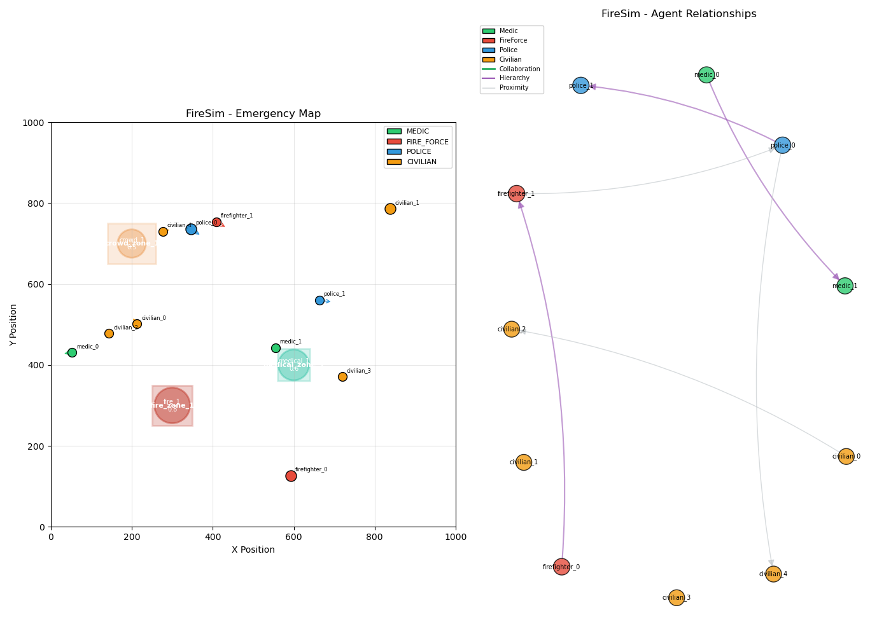
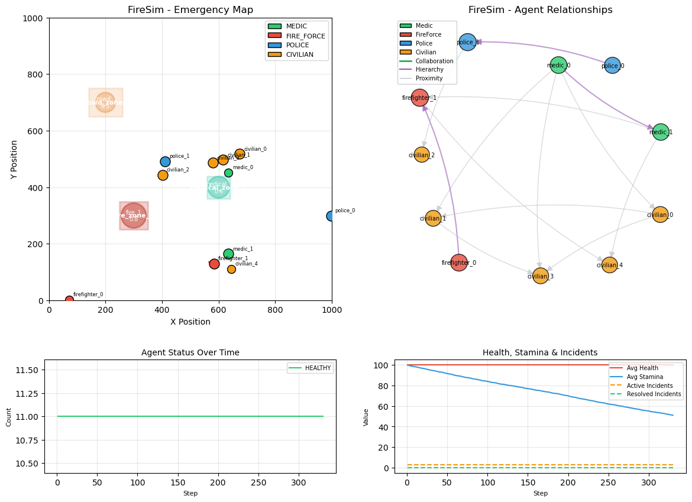

# Environment

## FireEnv Overview

`FireEnv` is the main environment class implementing the PettingZoo AEC (Agent Environment Cycle) API. It simulates an emergency response scenario where multiple agent types work together to handle various incidents.

## Basic Usage

```python
from emmarl.envs import FireEnv

# Create environment with default config
env = FireEnv()

# Initialize
env.reset()

# Run for one episode
for agent in env.agent_iter(max_iter=1000):
    observation = env.observe(agent)
    action = env.action_space(agent).sample()  # Your policy here
    env.step(action)

env.close()
```

## Visualization

The environment provides rendering for the Emergency Map with agent relationships and real-time metrics.

### EmergencyMap



### Live Rendering with Metrics

When running simulations, you can enable live rendering with real-time metrics:



The metrics panel shows:
- **Agent Status Over Time**: Number of agents in each status category (Healthy, Injured, Affected, Critical, Deceased)
- **Health, Stamina & Incidents**: Average health and stamina of agents, plus active and resolved incidents

To enable live rendering:

```python
import matplotlib.pyplot as plt

env = FireEnv()
env.reset()

plt.ion()
env.render(mode="human")
plt.show()

for _ in range(1000):
    for agent in env.agents:
        action = env.action_space(agent).sample()
        env.step(action)
    env.render(mode="human")
    plt.pause(0.01)

env.close()
```

## Configuration

### JSON Configuration (Recommended)

The recommended way to configure the environment is via JSON files:

```python
from emmarl.envs import FireEnv

# Load from JSON file
env = FireEnv("path/to/config.json")

# Or load using the config loader
from emmarl.envs.config_loader import load_config
config = load_config("path/to/config.json")
env = FireEnv(config)
```

The default configuration is located at `src/emmarl/envs/config/default_config.json`.

#### JSON Config Structure

```json
{
  "environment": {
    "map_width": 1000.0,
    "map_height": 1000.0,
    "max_steps": 1000,
    "agent_speed": 10.0,
    "agent_vision_radius": 100.0,
    "enable_fire_dynamics": true,
    "wind_speed": 10.0,
    "wind_direction": 0.0
  },
  "agents": {
    "num_medics": 2,
    "num_fire_force": 2,
    "num_police": 2,
    "num_civilians": 5,
    "type_configs": {
      "MEDIC": { ... },
      "FIRE_FORCE": { ... },
      "POLICE": { ... },
      "CIVILIAN": { ... }
    }
  },
  "action_ranges": { ... },
  "protection": { ... },
  "movement": { ... },
  "rewards": { ... },
  "terrain": { ... },
  "fire_dynamics": { ... },
  "map": { ... },
  "rendering": { ... },
  "graph_filter": { ... }
}
```

See [`default_config.json`](../../src/emmarl/envs/config/default_config.json) for a complete example.

### FireEnvConfig

You can also customize the environment directly with `FireEnvConfig`:

```python
from emmarl.envs.fire_env import FireEnvConfig

config = FireEnvConfig(
    num_medics=3,
    num_fire_force=4,
    num_police=2,
    num_civilians=10,
    map_width=2000.0,
    map_height=2000.0,
    max_steps=2000,
    agent_speed=15.0,
    agent_vision_radius=150.0,
    reward_weights={
        "incident_resolved": 100.0,
        "casualty_prevented": 50.0,
        "stamina_penalty": -0.1,
    }
)

env = FireEnv(config)
```

### Configuration Parameters

The JSON configuration supports the following parameters:

#### Environment Parameters

| Parameter | Type | Default | Description |
|-----------|------|---------|-------------|
| `map_width` | float | 1000.0 | Map width in units |
| `map_height` | float | 1000.0 | Map height in units |
| `max_steps` | int | 1000 | Maximum episode length |
| `agent_speed` | float | 10.0 | Base agent movement speed |
| `agent_vision_radius` | float | 100.0 | Agent observation radius |
| `enable_fire_dynamics` | bool | True | Enable fire propagation |
| `wind_speed` | float | 10.0 | Wind speed for fire model |
| `wind_direction` | float | 0.0 | Wind direction (radians) |

#### Agent Parameters

| Parameter | Type | Default | Description |
|-----------|------|---------|-------------|
| `num_medics` | int | 2 | Number of medic agents |
| `num_fire_force` | int | 2 | Number of firefighter agents |
| `num_police` | int | 2 | Number of police agents |
| `num_civilians` | int | 5 | Number of civilian agents |

#### Action Ranges

| Parameter | Default | Description |
|-----------|---------|-------------|
| `heal_range` | 30.0 | Medic heal range |
| `medication_range` | 20.0 | Medic medication range |
| `firefighter_range` | 50.0 | Firefighter action range |
| `foam_range` | 40.0 | Firefighter foam range |
| `police_range` | 60.0 | Police action range |
| `civilian_seek_help_distance` | 100.0 | Civilian seek help threshold |

#### Protection Factors

| Parameter | Default | Description |
|-----------|---------|-------------|
| `civilian_fire_range` | 100.0 | Civilian fire damage range |
| `civilian_protection` | 0.3 | Civilian protection factor |
| `firefighter_protection` | 0.1 | Firefighter protection factor |
| `medic_protection` | 0.2 | Medic protection factor |
| `police_protection` | 0.2 | Police protection factor |

#### Movement Parameters

| Parameter | Default | Description |
|-----------|---------|-------------|
| `safe_position_margin` | 50.0 | Margin for safe spawn positions |
| `danger_threshold` | 0.8 | Movement danger threshold |
| `stamina_restore_rate` | 0.5 | Stamina restore rate |
| `stamina_run_cost_multiplier` | 1.5 | Running stamina multiplier |
| `turn_rate` | 0.2 | Agent turn rate |

#### Reward Weights

| Parameter | Default | Description |
|-----------|---------|-------------|
| `incident_resolved` | 100.0 | Points for resolving incidents |
| `casualty_prevented` | 50.0 | Points for saving lives |
| `damage_reduced` | 25.0 | Points for reducing severity |
| `survived` | 20.0 | Points for surviving |
| `died` | -100.0 | Penalty for death |
| `stamina_penalty` | -0.1 | Penalty per step |
| `time_penalty` | -0.01 | Time penalty per step |

## Agent Types

The environment supports four agent types:

1. **Medic**: Heals agents, uses medication
2. **FireForce**: Extinguishes fires, uses foam
3. **Police**: Controls crowds, places barriers
4. **Civilian**: Seeks help, can be rescued

Each agent type has unique:
- Action space
- Movement properties
- Resources

See [Agents](agents.md) for details.

## Observations

Agents observe a local view of the environment:

```python
observation = env.observe(agent)
# Shape: (vision_radius*2, vision_radius*2, 4)
# Channels: agent types (medic, fire, police, civilian) + incidents
```

The observation is a 2D grid centered on the agent, containing:
- Other agents (color-coded by type)
- Active incidents (showing severity)
- Safe/danger zones

## Actions

Each agent type has its own action space. Common actions:

- **move**: 2D movement vector [-1, 1]
- **run**: Toggle running (1) or walking (0)

Type-specific actions:
- Medic: `heal`, `use_medication`, `communicate`
- FireForce: `extinguish`, `use_foam`, `communicate`
- Police: `control_crowd`, `place_barrier`, `communicate`
- Civilian: `seek_help`

## Rewards

The reward function considers:

- **incident_resolved**: Points for resolving incidents
- **casualty_prevented**: Points for saving lives
- **damage_reduced**: Points for reducing incident severity
- **survived**: Points for surviving
- **died**: Penalty for death
- **stamina_penalty**: Penalty for stamina depletion
- **time_penalty**: Small penalty per step

## Episode Termination

An episode ends when:
1. All incidents are resolved
2. All agents are dead
3. Maximum steps reached (truncation)

## Fire Dynamics

FireEnv includes a fire dynamics model based on the Rothermel model for realistic fire propagation, with advanced physics features:

### Core Rothermel Model

- Fire spreads based on wind speed and direction
- Terrain affects fuel properties
- Fire intensity and flame length calculated per position
- Agents take damage from fire, smoke, and heat

### Advanced Fire Physics

#### Heat Transfer & Thermal Diffusion
- `HeatMap` tracks cell temperatures across the grid
- Heat diffuses to adjacent cells using a diffusion coefficient
- Pre-heating zones form ahead of fire front (pyrolysis modeling)
- Terrain-specific diffusion rates (e.g., forest: 0.005, urban: 0.03)

#### Fire Spotting / Ember Transport
- Probabilistic ember generation based on fire intensity and wind
- `spotting_probability = fire_intensity * wind_speed * 0.0001`
- Embers travel up to `2.5 * wind_speed` meters
- New fire ignitions can start from ember landing

#### Crown Fire Dynamics
- Canopy properties added to terrain (base height, fuel load)
- Crown fire transition when:
  - Surface fire intensity > 300 kW/m
  - Canopy base height < 6m
  - Canopy bulk density > 0.1 kg/m³
- Crown fire spreads 1.5-2.0x faster than surface fire

#### Fire Perimeter Evolution
- `FirePerimeter` tracks fire as polygon
- Computes area and perimeter for accurate ROS calculations
- Point-in-polygon checks for containment

#### Containment Lines
- Fire lines reduce spread probability based on distance
- Effectiveness: up to 95% when fire is directly on line
- Progressive containment reduces ROS multiplicatively

### FireState Properties

```python
from emmarl.envs.fire_dynamics import FireState

fire_state = FireState(
    position=(100.0, 200.0),
    intensity=0.8,
    rate_of_spread=5.0,
    fire_line_intensity=400.0,  # kW/m
    flame_length=2.5,  # meters
    temperature=800.0,  # Kelvin
    pre_heating=0.5,  # pre-heat factor
    is_crown_fire=False,
    ember_count=3,
)
```

### Accessing Fire Properties

```python
# Get fire intensity at a point
intensity = fire_model.get_intensity_at((x, y))

# Get fire area and perimeter
area = fire_model.get_fire_area()
perimeter = fire_model.get_fire_perimeter_length()

# Check if point is inside fire
is_burning = fire_model.is_point_in_fire((x, y))

# Get temperature at a point
temp = fire_model.get_temperature_at((x, y))

# Get pre-heat level
preheat = fire_model.get_preheat_at((x, y))

# Active ember count
ember_count = fire_model.get_active_ember_count()
```

Enable/disable with `enable_fire_dynamics` config option.

## PettingZoo API

FireEnv follows the PettingZoo AEC API:

```python
# Reset environment
env.reset(seed=42, options={})

# Iterate through agents
for agent in env.agent_iter(max_iter=1000):
    obs = env.observe(agent)
    action = policy(obs)
    env.step(action)

# Check termination
if env.terminations[agent] or env.truncations[agent]:
    # Agent done

# Access info
info = env.infos[agent]
```

See [PettingZoo documentation](https://pettingzoo.farama.org/) for more details.
